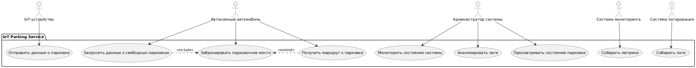
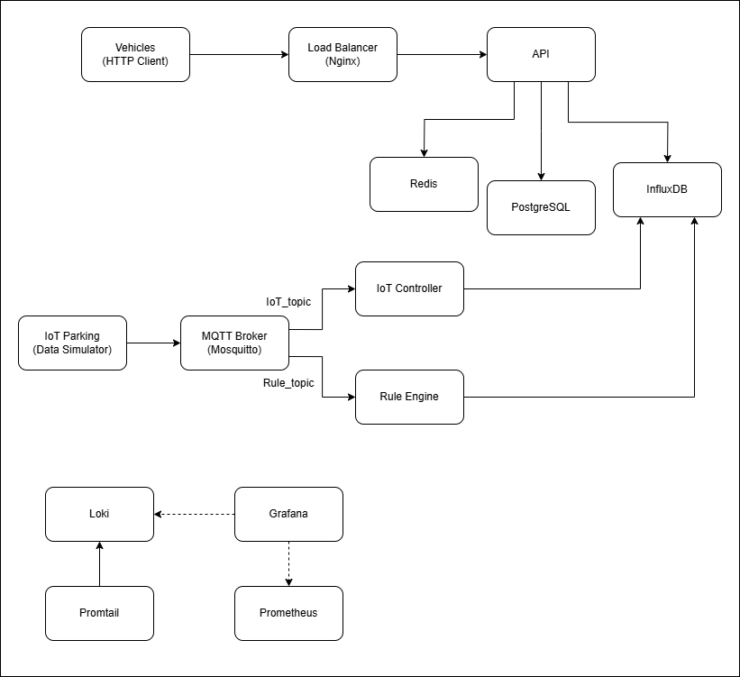

# highload-2025

---

# IoT Parking Service

IoT Parking Service - это сервис, который собирает данные о свободных местах на парковках с помощью IoT-устройств и предоставляет эту информацию автономным автомобилям для бронирования мест и построения маршрутов.

---

# Функциональность проекта

## API

- Обработка данных от IoT-устройств (эмулируемых через Data Simulator) и обновление информации о парковках в базе данных.
- Передача данных о свободных местах на парковках автономным автомобилям в реальном времени.
- Валидация поступающих данных через IoT Controller.
- Проверка данных на соответствие мгновенным и длительным правилам через Rule Engine.
- Хранение событий и состояний парковок для последующего анализа.
- Предоставление возможности автомобилям запросить ближайшую свободную парковку.

## База данных

- InfluxDB — для хранения временных рядов (состояние парковок с метками времени).
- PostgreSQL — для хранения метаданных (информация о парковках).
  - **Шардирование** — реализована физическая репликация PostgreSQL с несколькими репликами для распределения нагрузки.
  - **Реплики** — настроены слоты репликации для надежного распространения данных между master и replica узлами.
  - **PgBouncer** — реализовано управление пулом соединений для оптимизации использования ресурсов БД.

## Балансировщик нагрузки

- Nginx — для распределения запросов между микросервисами.
  - Используется метод Least Connections
  - Настройка проверок здоровья сервисов для отказоустойчивости

## Брокер сообщений

- Mosquitto — для передачи данных от IoT-устройств к другим компонентам системы.

## Кэш

- Redis — для быстрого доступа к часто используемым данным:
  - Кэширование текущего состояния парковок (**device_id**, **free_spots**, **timestamp**)
  - Снижение нагрузки на базы данных для часто запрашиваемой информации
  - Настроенное время жизни (TTL) для разных типов данных
  - Поддержка частичного обновления кэша для оптимизации производительности
  - Реализована стратегия "write-through" для обеспечения консистентности данных

## Loki-стек

- Promtail и Loki — для сбора и анализа логов системы.

## Мониторинг

- Grafana и Prometheus — для визуализации метрик и мониторинга производительности.

### Алерты Prometheus

Настроены базовые алерты для мониторинга инфраструктуры:

- **HighCpuUsage** — использование процессора превышает 80% в течение 5 минут
- **HighMemoryUsage** — объем оперативной памяти превышает 75% в течение 5 минут
- **ServiceDown** — сервисы недоступны более 30 секунд

Алерты обрабатываются через AlertManager и доступны по адресу:

- Prometheus алерты: http://localhost:9090/alerts
- AlertManager: http://localhost:9093

---

# Формирование требований

## Максимальное количество пользователей

В проекте учитываются два типа "пользователей": IoT-устройства, передающие данные, и автономные автомобили, запрашивающие информацию.

- Максимальное количество IoT-устройств:
  На старте сервис рассчитан на 150 устройств, каждое из которых отправляет данные каждые 4 секунды. В перспективе возможно масштабирование до 1000 устройств для обслуживания крупных городов или сети парковок.

- Максимальное количество автомобилей:
  Предполагается поддержка 500-1000 автономных автомобилей в часы пик, каждый с возможностью до 2 активных сессий (например, запрос состояния и бронирование). Итого максимум 1000-2000 сессий.

## Требуемая скорость обработки запросов

- Время отклика на запросы автомобилей:
  Целевое время — 200 мс для большей части запросов, допустимый диапазон — 200-500 мс, чтобы обеспечить быструю реакцию для навигации.

- Время обработки внутренних операций:
  Простые операции (например, валидация данных в IoT Controller, запись в InfluxDB) — 50 мс. Сложные операции (проверка правил в Rule Engine) — 50-100 мс.

## Объём хранимой информации

- Прогнозируемый объём данных на старте:
  С 150 устройствами, отправляющими данные каждые 4 секунды (сообщение ~65 байт), объём составляет:
  150 × (86400 ÷ 4) × 65 = ~200.8 МБ/день.
  С учётом логов (Loki) и метрик (Prometheus) — ~250 МБ/день.
  Данные в PostgreSQL (данные парковок, бронирования) добавляют незначительный объём (~1-5 МБ на старте).

- Возможный рост объёма данных:
  При масштабировании до 1000 устройств:
  1000 × (86400 ÷ 4) × 65 = ~1.34 ГБ/день.
  С учётом логов и метрик — до 1.5-2 ГБ/день.
  Рост числа автомобилей добавит данные о бронированиях (~10-20 МБ ежегодно).

---

# Диаграмма прецедентов

<picture>
    
</picture>

# Архитектура системы

<picture>
    
</picture>

---

# Установка и запуск

## Предварительные требования

- Docker и Docker Compose
- .NET 9.0 SDK (для разработки)

## Запуск системы

### 1. Полный запуск всех сервисов

```bash
docker-compose -f docker-compose.yml -f docker-compose.scale.yml -f docker-compose.monitoring.yml up -d
```

### 2. Запуск с мониторингом

```bash
docker-compose -f docker-compose.yml -f docker-compose.monitoring.yml up -d
```

### 3. Запуск с горизонтальным масштабированием и шардированием

```bash
API_REPLICAS=3 PG_MAX_CONNECTIONS=200 docker-compose -f docker-compose.yml -f docker-compose.scale.yml up -d
```

### 4. Запуск только для тестирования

```bash
docker-compose -f docker-compose.tests.yml up -d
```

## Доступ к сервисам

После запуска системы будут доступны следующие интерфейсы:

- **ParkingApi**: http://localhost:8080
- **Grafana**: http://localhost:3000 (admin/admin)
- **Prometheus**: http://localhost:9090
- **InfluxDB**: http://localhost:8086
- **PostgreSQL**: localhost:5432
- **Redis**: localhost:6379
- **Mosquitto MQTT**: localhost:1883

---

# Тестирование

## Структура тестов

Проект содержит следующие тесты:

- **ParkingApi/tests/** - Unit-тесты для API контроллеров и сервисов, интеграционные тесты для проверки взаимодействие между компонентами системы.
- **data_simulator/tests/** - Тесты симулятора данных IoT
- **rule_engine/tests/** - Тесты движка правил
- **vehicle_simulator/tests/** - Тесты симулятора автомобилей

## Запуск тестов

### Запуск unit-тестов для .NET проектов

```bash
# Тесты ParkingApi
cd ParkingApi
dotnet test

# Тесты всего решения
dotnet test highload-2025.sln
```

### Запуск тестов в Docker

```bash
# Запуск тестового окружения
docker-compose -f docker-compose.tests.yml up -d

# Запуск интеграционных тестов
docker-compose -f docker-compose.tests.yml exec test-runner dotnet test
```

### Запуск тестов масштабирования

```bash
# Вертикальное масштабирование
./tsung/scripts/vertical-scaling-test.sh

# Горизонтальное масштабирование
./tsung/scripts/horizontal-scaling-test.sh

# Анализ результатов масштабирования
./tsung/scripts/analyze-scaling-results.sh
```

## Описание тестов

### Unit-тесты ParkingApi

- **ControllerTests** - Тестирование API контроллеров
- **ServiceTests** - Тестирование бизнес-логики сервисов
- **DatabaseTests** - Тестирование работы с PostgreSQL и InfluxDB
- **ValidationTests** - Тестирование валидации входных данных

### Интеграционные тесты

- **IoT Data Flow Tests** - Проверка потока данных от IoT устройств через MQTT до баз данных
- **Vehicle API Tests** - Тестирование API для автомобилей
- **Rule Engine Tests** - Проверка работы движка правил
- **Load Tests** - Нагрузочные тесты системы

### Тесты производительности

- Проверка соответствия требованиям по времени отклика (200-500 мс)
- Тестирование пропускной способности для 1000+ устройств
- Проверка масштабируемости до 2000 сессий
- Тесты эффективности кэширования и шардирования данных

## Мониторинг тестов

### Метрики в Grafana

После запуска с мониторингом доступны дашборды:

- **System Overview** - Общая производительность системы
- **API Performance** - Метрики API (время отклика, throughput)
- **Database Metrics** - Производительность PostgreSQL и InfluxDB
- **IoT Data Flow** - Метрики потока данных от IoT устройств
- **Cache Performance** - Эффективность кэширования и hit/miss rate
- **DB Sharding** - Метрики распределения нагрузки между репликами

### Логи в Loki

Логи всех сервисов собираются через Promtail и доступны в Grafana через Loki datasource.

---

# Разработка

## Структура проекта

- **ParkingApi/** - Основное API на .NET 9
- **iot_controller/** - Контроллер IoT устройств
- **rule_engine/** - Движок обработки правил
- **data_simulator/** - Симулятор IoT устройств
- **vehicle_simulator/** - Симулятор автомобилей
- **monitoring/** - Конфигурации мониторинга
- **postgresql/** - Скрипты базы данных
- **mosquitto/** - MQTT брокер конфигурация

## Конфигурация

### Environment Variables

Основные переменные окружения настраиваются в `docker-compose.yml`:

- `POSTGRES_CONNECTION` - строка подключения к PostgreSQL
- `INFLUXDB_URL` - URL InfluxDB
- `MQTT_BROKER_URL` - URL MQTT брокера
- `REDIS_CONNECTION` - строка подключения к Redis
- `API_REPLICAS` - количество экземпляров API для горизонтального масштабирования
- `PG_MAX_CONNECTIONS` - максимальное количество соединений PostgreSQL
- `POSTGRES_REPLICATION_USER` - пользователь для репликации PostgreSQL
- `CACHE_TTL_SECONDS` - время жизни объектов в кэше Redis

### Конфигурационные файлы

- `nginx.conf` - Конфигурация балансировщика нагрузки
- `loki-config.yaml` - Настройки Loki для сбора логов
- `promtail-config.yaml` - Конфигурация Promtail
- `postgres/replica.conf` - Конфигурация PostgreSQL для реплик
- `postgres/pg_hba.conf` - Настройки доступа к PostgreSQL
